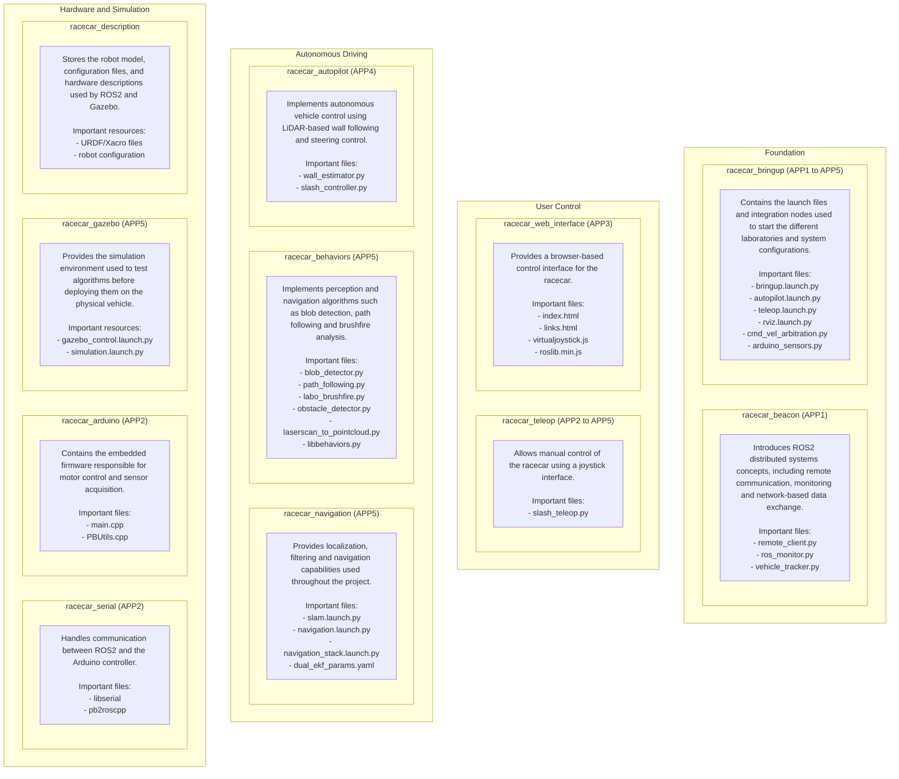

# Racecar Packages Overview

This diagram provides a high-level overview of the project packages and their primary responsibilities and scripts.
This also display APP-package relation.

```mermaid
flowchart TB

    %% ======================
    %% FOUNDATION
    %% ======================

    subgraph Foundation["Foundation"]
        direction LR

        subgraph Beacon["racecar_beacon (APP1)"]
            BC["Introduces ROS2 distributed systems concepts, including remote communication, monitoring and network-based data exchange.

Important files:
- remote_client.py
- ros_monitor.py
- vehicle_tracker.py"]
        end

        subgraph Bringup["racecar_bringup (APP1 to APP5)"]
            B["Contains the launch files and integration nodes used to start the different laboratories and system configurations.

Important files:
- bringup.launch.py
- autopilot.launch.py
- teleop.launch.py
- rviz.launch.py
- cmd_vel_arbitration.py
- arduino_sensors.py"]
        end
    end

    %% ======================
    %% USER CONTROL
    %% ======================

    subgraph UserControl["User Control"]
        direction LR

        subgraph Teleop["racecar_teleop (APP2 to APP5)"]
            T["Allows manual control of the racecar using a joystick interface.

Important files:
- slash_teleop.py"]
        end

        subgraph Web["racecar_web_interface (APP3)"]
            W["Provides a browser-based control interface for the racecar.

Important files:
- index.html
- links.html
- virtualjoystick.js
- roslib.min.js"]
        end
    end

    %% ======================
    %% AUTONOMOUS FUNCTIONS
    %% ======================

    subgraph Autonomy["Autonomous Driving"]
        direction LR

        subgraph Navigation["racecar_navigation (APP5)"]
            N["Provides localization, filtering and navigation capabilities used throughout the project.

Important files:
- slam.launch.py
- navigation.launch.py
- navigation_stack.launch.py
- dual_ekf_params.yaml"]
        end

        subgraph Behaviors["racecar_behaviors (APP5)"]
            BH["Implements perception and navigation algorithms such as blob detection, path following and brushfire analysis.

Important files:
- blob_detector.py
- path_following.py
- labo_brushfire.py
- obstacle_detector.py
- laserscan_to_pointcloud.py
- libbehaviors.py"]
        end

        subgraph Autopilot["racecar_autopilot (APP4)"]
            A["Implements autonomous vehicle control using LiDAR-based wall following and steering control.

Important files:
- wall_estimator.py
- slash_controller.py"]
        end
    end

    %% ======================
    %% HARDWARE / SIMULATION
    %% ======================

    subgraph Platform["Hardware and Simulation"]
        direction LR

        subgraph Serial["racecar_serial (APP2)"]
            S["Handles communication between ROS2 and the Arduino controller.

Important files:
- libserial
- pb2roscpp"]
        end

        subgraph Arduino["racecar_arduino (APP2)"]
            AR["Contains the embedded firmware responsible for motor control and sensor acquisition.

Important files:
- main.cpp
- PBUtils.cpp"]
        end

    subgraph Gazebo["racecar_gazebo (APP5)"]
        G["Provides the simulation environment used to test algorithms before deploying them on the physical vehicle.

Important resources:
- gazebo_control.launch.py
- simulation.launch.py"]
    end

    subgraph Description["racecar_description"]
        D["Stores the robot model, configuration files, and hardware descriptions used by ROS2 and Gazebo.

    Important resources:
    - URDF/Xacro files
    - robot configuration"]
        end
    end
```
